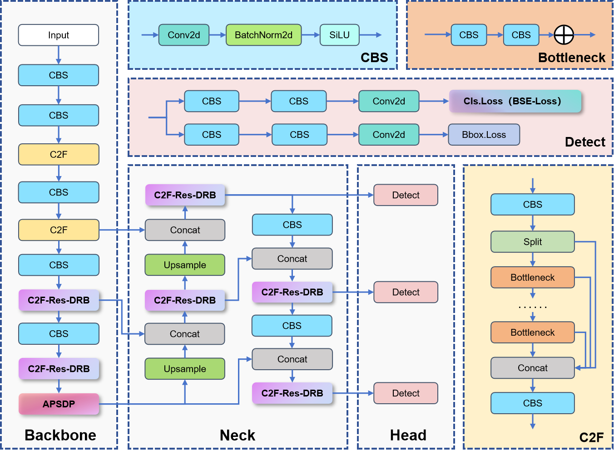
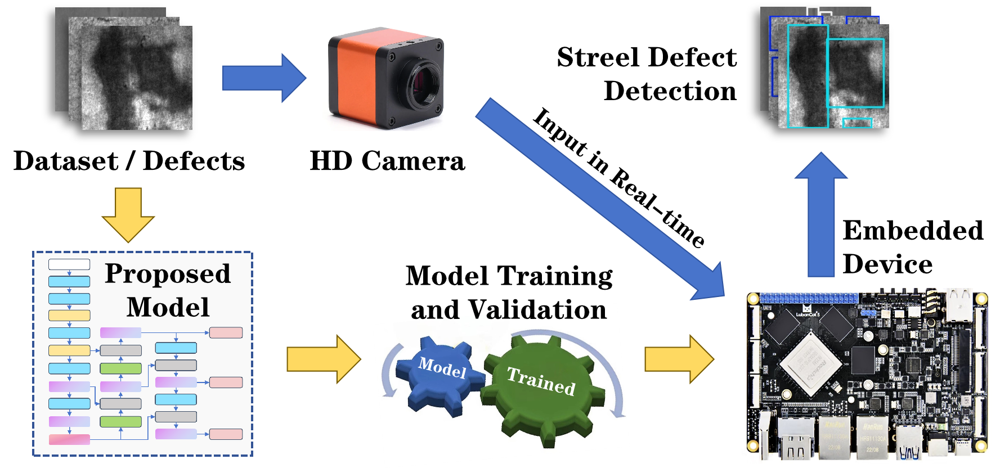
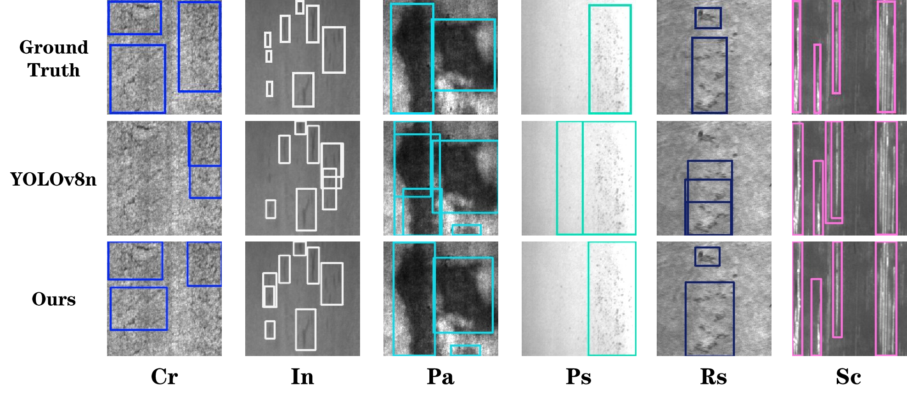
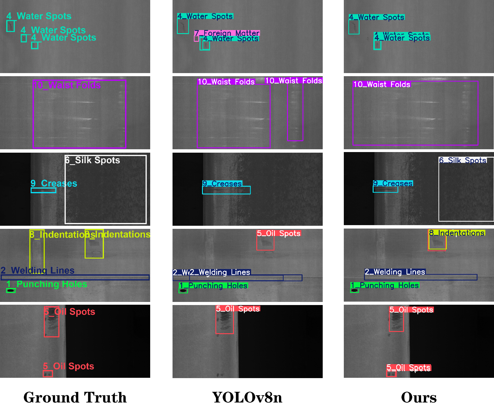

# RLA-YOLO

## Introduction | 简介

Steel plate surface defect detection faces significant challenges, including frequent missed detections, false detections, and slow processing speeds. To address these issues, we propose **RLA-YOLO**, an improved defect detection model based on YOLOv8n. RLA-YOLO integrates three key innovations to enhance receptive field awareness, optimize multi-scale feature extraction, and improve loss function effectiveness.

钢板表面缺陷检测面临诸多挑战，包括漏检、误检和处理速度慢等问题。为了解决这些问题，我们提出了**RLA-YOLO**，一种基于 YOLOv8n 改进的缺陷检测模型。RLA-YOLO 通过三个关键创新，提高感受野感知能力、优化多尺度特征提取，并改进损失函数的有效性。

可以这样补充你的 **Repository Content / 仓库内容**，保持中英文对照风格，同时说明数据集结构和下载链接：

---

## Repository Content | 仓库内容

This repository provides the implementation of the three key modules proposed in RLA-YOLO:

1. **Adaptive Parameter-sharing Dilated Pyramid (APSDP)** (Only **PSDP** module is provided)
2. **C2f-Res-DRB** (Include Res-DRB)
3. **BSE-Loss**

Users can integrate these modules into their own YOLO-based models to enhance defect detection performance.

In this work, two datasets used in the experiments are provided, each containing the following structure:

* **origin/**: original images
* **augmented/**: images after data augmentation
* **classified/**: images organized by class

The datasets can be downloaded from this link: **XXX**

---

本仓库提供了 RLA-YOLO 提出的三个主要创新模块的实现：

1. **自适应参数共享膨胀金字塔模块（APSDP）**（仅提供 **PSDP** 模块）
2. **C2f-Res-DRB**（包含 Res-DRB 残差膨胀重参数块）
3. **BSE-Loss 自适应损失函数**

本实验所用的两个数据集也提供下载，每个数据集包含如下结构：

* **origin/**：原始图片
* **augmented/**：数据增强后的图片
* **classified/**：按类别整理的图片

可从该链接获取数据集：**XXX**

---

## Key Modules | 关键模块

### 1. Adaptive Parameter-sharing Dilated Pyramid (APSDP) 

The **APSDP module** replaces the conventional Spatial Pyramid Pooling - Fast (SPPF) module, incorporating:

- **Parameter-sharing Dilated Convolution (PSD-Conv):** Expands the receptive field efficiently while reducing redundant parameters.
- **Adaptive Fine-grained Channel Attention (AFGC-Attention):** Enhances feature extraction by dynamically refining channel-wise representations. (*AFGC-Attention module is obtained from **[UBRFC-Net](https://github.com/Lose-Code/UBRFC-Net?utm_source=chatgpt.com)**.*)

**APSDP 模块**替代了传统的 Spatial Pyramid Pooling - Fast (SPPF) 模块，主要包括：

- **参数共享膨胀卷积（PSD-Conv）：** 在减少冗余参数的同时，有效扩展感受野。
- **自适应细粒度通道注意力（AFGC-Attention）：** 通过动态优化通道级特征表示，增强特征提取能力。（*AFGC-Attention 模块来源于 **[UBRFC-Net](https://github.com/Lose-Code/UBRFC-Net?utm_source=chatgpt.com)**。*）

This module significantly improves the model's capability to capture both global and local defect features.

该模块显著增强了模型捕捉全局和局部缺陷特征的能力。

**Note:** This repository only provides the **PSDP** module.

**注意：** 本仓库仅提供 **PSDP** 模块。

### 2. C2f-Res-DRB

The **Res-DRB module** is designed to replace the Bottleneck in the Coarse-to-Fine (C2F) module, featuring:

- **Dilated Reparam Block (DRB):** Enables enhanced multi-scale feature extraction and long-range dependency modeling.
- **Residual Connection Mechanism:** Preserves important feature information and improves gradient flow.

**Res-DRB 模块**替代了 Coarse-to-Fine（C2F）模块中的 Bottleneck 结构，主要包括：

- **膨胀重参数块（DRB）：** 增强多尺度特征提取能力，并优化长距离依赖建模。
- **残差连接机制：** 保留重要特征信息，并改善梯度流动。

This module enhances the detection of complex defects, particularly those with varying shapes and scales.

该模块提高了对复杂缺陷的检测能力，特别是形态和尺度变化较大的缺陷。

### 3. BSE-Loss: An Adaptive Loss Function

To tackle sample imbalance issues in defect detection, we introduce **BSE-Loss**, which replaces the traditional Binary Cross-Entropy Loss (BCE-Loss) by incorporating:

- **Slide Weighting Function:** Adjusts weights dynamically to emphasize hard-to-classify samples.
- **Exponentially Weighted Moving Average (EWMA):** Stabilizes weight adjustments and improves learning efficiency.

为了解决缺陷检测中的样本不均衡问题，我们引入了 **BSE-Loss**，它替代了传统的二元交叉熵损失（BCE-Loss），并引入以下机制：

- **滑动加权函数：** 动态调整样本权重，增强对难分类样本的关注。
- **指数加权移动平均（EWMA）：** 稳定权重调整，提高学习效率。

This loss function significantly enhances the model's ability to learn from challenging samples, leading to better detection performance.

该损失函数大幅提升了模型对挑战性样本的学习能力，从而提高检测性能。

## Performance Evaluation | 性能评估

#### Experiment Environment | 实验环境  
The experiment was conducted on a local server with the following configuration:  

- **GPU**: RTX 2080 Ti (11GB)  
- **CPU**: Intel(R) Core(TM) i7-9800X  
- **RAM**: 64GB  
- **Operating System**: Windows 10  
- **Software Environment**: Python 3.11, PyTorch 2.2.2, CUDA 12.1  

实验在本地服务器上进行，具体配置如下：  

- **GPU**：RTX 2080 Ti（11GB）  
- **CPU**：Intel(R) Core(TM) i7-9800X  
- **内存**：64GB  
- **操作系统**：Windows 10  
- **软件环境**：Python 3.11、PyTorch 2.2.2、CUDA 12.1  

---  

### NEU-DET Dataset Results | NEU-DET 数据集结果
RLA-YOLO was validated on the **NEU-DET** dataset, achieving:

- **mAP50: 0.763** (outperforming existing methods)
- **Computational Overhead: 7.5 GFLOPs** (efficient processing)
- **Detection Speed: 105.4 FPS** (real-time capability)

我们在 **NEU-DET** 数据集上验证了 RLA-YOLO，并取得了以下结果：

- **mAP50: 0.763**（优于现有方法）
- **计算开销：7.5 GFLOPs**（高效处理）
- **检测速度：105.4 FPS**（实时检测能力）

#### Detection Visualization | 检测可视化对比
Below is the detection comparison on the **NEU-DET** dataset, where RLA-YOLO demonstrates improved detection accuracy.

以下是 **NEU-DET** 数据集上的检测结果对比，RLA-YOLO 在目标识别上表现更优。

---

### GC10-DET Dataset Results | GC10-DET 数据集结果
Further experiments on the **GC10-DET** dataset confirmed the model's improved detection accuracy.

进一步的实验表明，在 **GC10-DET** 数据集上，该模型的检测精度也得到了提升。

#### Detection Visualization | 检测可视化对比
The following visualization illustrates the detection performance on the **GC10-DET** dataset.

以下是 **GC10-DET** 数据集的目标检测结果可视化对比。

