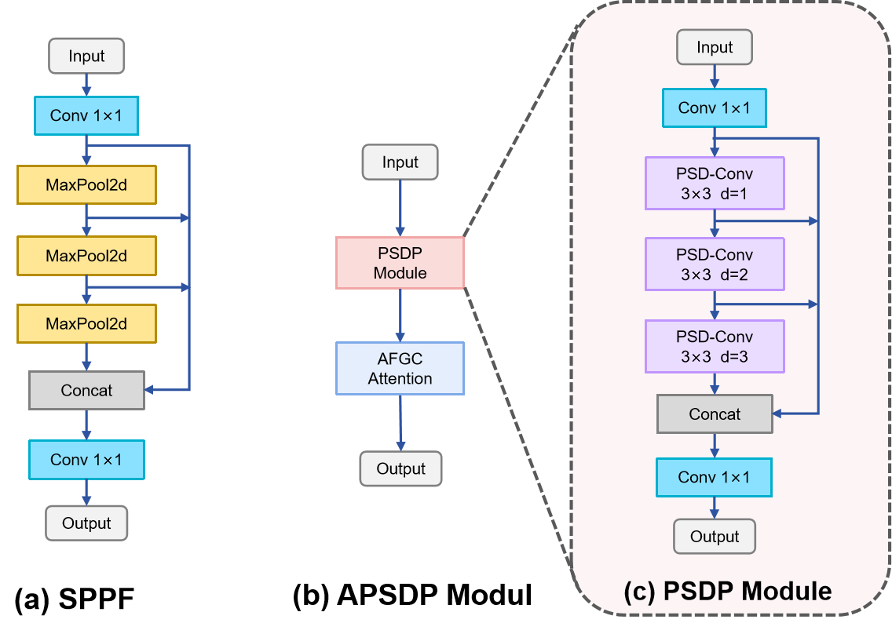
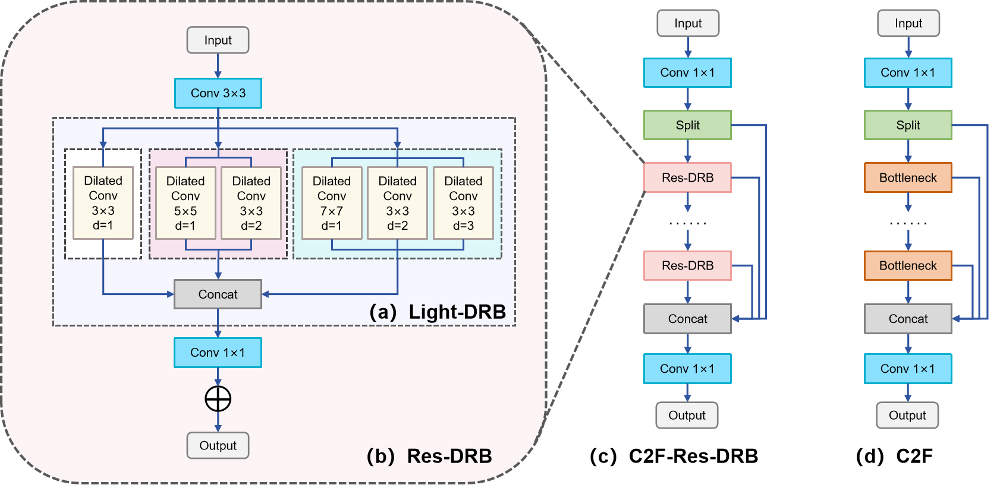
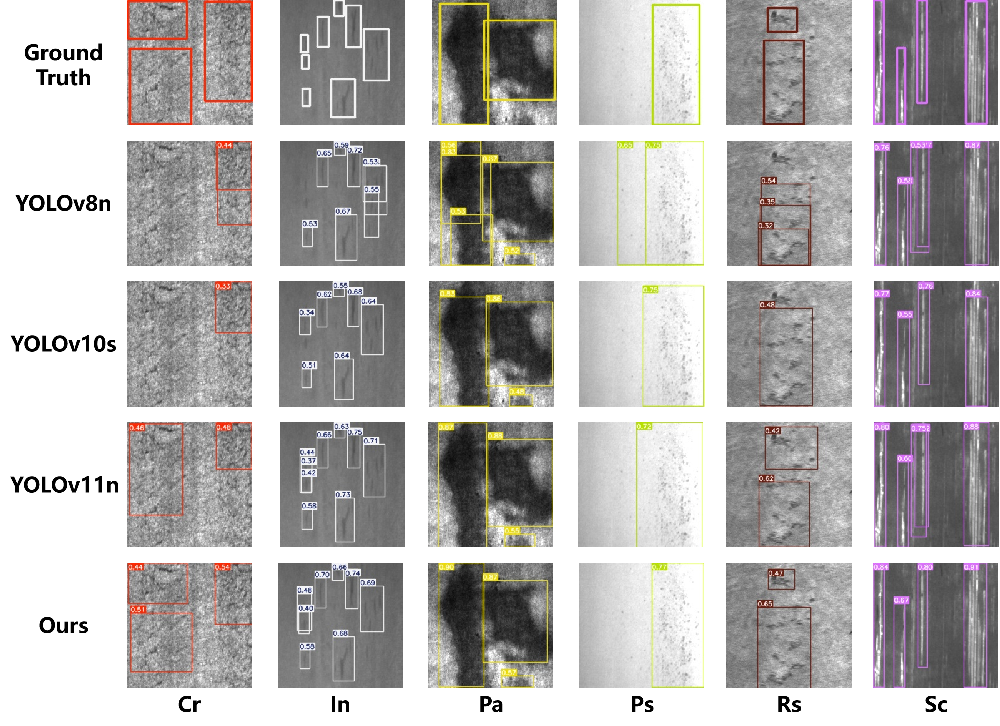

Manual inspection in steel manufacturing is inefficient and costly, creating a need for automated high-speed defect detection. We propose **RLA-YOLO**, an improved steel surface defect detection model based on YOLOv8n. It introduces three key innovations to enhance receptive field, optimize multi-scale feature extraction, and improve loss function effectiveness. Experiments on NEU-DET and GC10-DET show that RLA-YOLO achieves higher accuracy, lower computational cost, and real-time performance, making it suitable for deployment on resource-constrained devices.

---

## Repository Content

This repository provides the implementation of the three key modules proposed in RLA-YOLO:

1. **Adaptive Parameter-sharing Dilated Pyramid (APSDP)** (Only **PSDP** module is provided)
2. **C2f-Res-DRB** (Include Res-DRB)
3. **BSE-Loss**

Users can integrate these modules into their own YOLO-based models to enhance defect detection performance.

Two datasets used in our experiments are also provided. Each dataset includes both **images and corresponding annotation files**, organized as follows:

* **origin/**: original images and their labels
* **augmented/**: images after data augmentation and corresponding updated labels
* **classified/**: images organized by class, with corresponding labels

The datasets can be downloaded from this link: [Datasets.zip](https://katfile.cloud/lbhuyvghuwul/Datasets.zip.html)

---

## Key Modules

### 1. Adaptive Parameter-sharing Dilated Pyramid (APSDP)

The **APSDP module** replaces the conventional Spatial Pyramid Pooling - Fast (SPPF) module, incorporating:

* **Parameter-sharing Dilated Convolution (PSD-Conv):** Expands the receptive field efficiently while reducing redundant parameters.
* **Adaptive Fine-grained Channel Attention (AFGC-Attention):** Enhances feature extraction by dynamically refining channel-wise representations. (*AFGC-Attention module is obtained from **[UBRFC-Net](https://github.com/Lose-Code/UBRFC-Net?utm_source=chatgpt.com)**.*)

This module significantly improves the model's capability to capture both global and local defect features.

**Note:** This repository only provides the **PSDP** module.

---

### 2. C2f-Res-DRB

The **Res-DRB module** is designed to replace the Bottleneck in the Coarse-to-Fine (C2F) module, featuring:

* **Dilated Reparam Block (DRB):** Enables enhanced multi-scale feature extraction and long-range dependency modeling.
* **Residual Connection Mechanism:** Preserves important feature information and improves gradient flow.

This module enhances the detection of complex defects, particularly those with varying shapes and scales.

---

### 3. BSE-Loss: An Adaptive Loss Function

To tackle sample imbalance issues in defect detection, we introduce **BSE-Loss**, which replaces the traditional Binary Cross-Entropy Loss (BCE-Loss) by incorporating:

* **Slide Weighting Function:** Adjusts weights dynamically to emphasize hard-to-classify samples.
* **Exponentially Weighted Moving Average (EWMA):** Stabilizes weight adjustments and improves learning efficiency.

This loss function significantly enhances the model's ability to learn from challenging samples, leading to better detection performance.

---

## Performance Evaluation

### Experiment Environment

The experiment was conducted on a local server with the following configuration:

* **GPU**: RTX 2080 Ti (11GB)
* **CPU**: Intel(R) Core(TM) i7-9800X
* **RAM**: 64GB
* **Operating System**: Windows 10
* **Software Environment**: Python 3.11, PyTorch 2.2.2, CUDA 12.1

---

### NEU-DET Dataset Results

RLA-YOLO was validated on the **NEU-DET** dataset, achieving:

* **mAP50: 0.763** (outperforming existing methods)
* **Computational Overhead: 7.5 GFLOPs** (efficient processing)
* **Detection Speed: 105.4 FPS** (real-time capability)

#### Detection Visualization

Below is the detection comparison on the **NEU-DET** dataset, where RLA-YOLO demonstrates improved detection accuracy.

---

### GC10-DET Dataset Results

Further experiments on the **GC10-DET** dataset confirmed the model's improved detection accuracy.

#### Detection Visualization

The following visualization illustrates the detection performance on the **GC10-DET** dataset.

