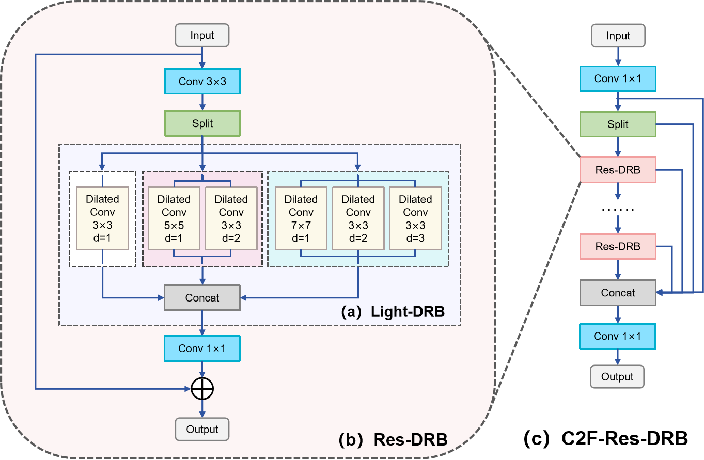

Manual inspection in steel manufacturing is inefficient and costly, creating a need for automated high-speed defect detection. We propose **RLA-YOLO**, an improved steel surface defect detection model based on YOLOv8n. It introduces three key innovations to enhance receptive field, optimize multi-scale feature extraction, and improve loss function effectiveness. Experiments on NEU-DET and GC10-DET show that RLA-YOLO achieves higher accuracy, lower computational cost, and real-time performance, making it suitable for deployment on resource-constrained devices.

The related paper has been published in ***Digital Signal Processing (Elsevier)*** as:
***[RLA-YOLO: A Lightweight and Accurate Method for Real-Time Steel Plate Defect Detection](https://doi.org/10.1016/j.dsp.2025.105700)***.

---

## Repository Content

This repository provides the official implementation of the three core modules proposed in **RLA-YOLO**:

1. **PSDP** —  [Parameter-sharing Dilated Pyramid](https://github.com/nickmeng86/RLA-YOLO-modules/tree/main/01_PSDP)

2. **Res-DRB** — [Residual Dilated Reparam Block](https://github.com/nickmeng86/RLA-YOLO-modules/tree/main/02_Res-DRB)

3. **BSE-Loss** — [BCE with Slide Function & EWMA Loss](https://github.com/nickmeng86/RLA-YOLO-modules/tree/main/03_BSE-Loss)

The datasets used in our experiments can be downloaded below:

* **NEU-DET (origin)** — [Download (26.7 MB)](https://katfile.cloud/ll3ce98hg6na/NEU-DET.zip.html)
* **GC10-DET (origin)** — [Download (925.7 MB)](https://katfile.cloud/s48sbqz306kn/GC10-DET.zip.html)

---

## Erratum

We discovered that the structural diagram of the C2f-Res-DRB in our published paper was incorrect. The mistake resulted from referencing an online blog whose structure did not match the actual implementation in the source code. This repository has corrected the diagram, and the image provided here reflects the accurate architecture of the module.

---

## Key Modules

### 1. Adaptive Parameter-sharing Dilated Pyramid (APSDP)

The **APSDP module** replaces the conventional SPPF module, incorporating:

* **Parameter-sharing Dilated Pyramid (PSDP):** Constructed from **Parameter-sharing Dilated Convolutions (PSD-Convs)**, enabling efficient receptive-field expansion while reducing redundant parameters.
* **Adaptive Fine-grained Channel Attention (AFGC-Attention):** Enhances feature extraction by dynamically refining channel-wise representations.

This module significantly improves the model's capability to capture both global and local defect features.

**Note:** This repository provides only the **PSDP** module. **AFGC-Attention** can be sourced from **[UBRFC-Net](https://github.com/Lose-Code/UBRFC-Net)**.

---

### 2. C2f-Residual Dilated Reparam Block (C2f-Res-DRB)

The **Res-DRB** is designed to replace the Bottleneck in the C2F module, featuring:

* **Dilated Reparam Block (DRB):** Enables enhanced multi-scale feature extraction and long-range dependency modeling.
* **Residual Connection Mechanism:** Preserves important feature information and improves gradient flow.

This module enhances the detection of complex defects, particularly those with varying shapes and scales.

---

### 3. BSE-Loss: An Adaptive Loss Function

To tackle sample imbalance issues in defect detection, we introduce **BSE-Loss**, which builds upon the Binary Cross-Entropy Loss (BCE-Loss) by incorporating:

* **Slide Weighting Function:** Adjusts weights dynamically to emphasize hard-to-classify samples.
* **Exponentially Weighted Moving Average (EWMA):** Stabilizes weight adjustments and improves learning efficiency.

This loss function significantly enhances the model's ability to learn from challenging samples, leading to better detection performance.

---

## Performance Evaluation

### Experiment Environment

The experiment was conducted on a local server with the following configuration:

* **GPU**: RTX 2080 Ti (11GB)
* **CPU**: Intel(R) Core(TM) i7-9800X
* **RAM**: 64GB
* **Operating System**: Windows 10
* **Software Environment**: Python 3.11, PyTorch 2.2.2, CUDA 12.1

---

### NEU-DET Dataset Results

RLA-YOLO was validated on the **NEU-DET** dataset, achieving:

* **mAP50: 0.763** (outperforming YOLOv8n)
* **Computational Overhead: 7.5 GFLOPs** (efficient processing)
* **Detection Speed: 105.4 FPS** (real-time capability)

#### Detection Visualization

Below is the detection comparison on the **NEU-DET** dataset, where RLA-YOLO demonstrates improved detection accuracy.

---

### GC10-DET Dataset Results

Further experiments on the **GC10-DET** dataset confirmed the model's improved detection accuracy.

#### Detection Visualization

The following visualization illustrates the detection performance on the **GC10-DET** dataset.

